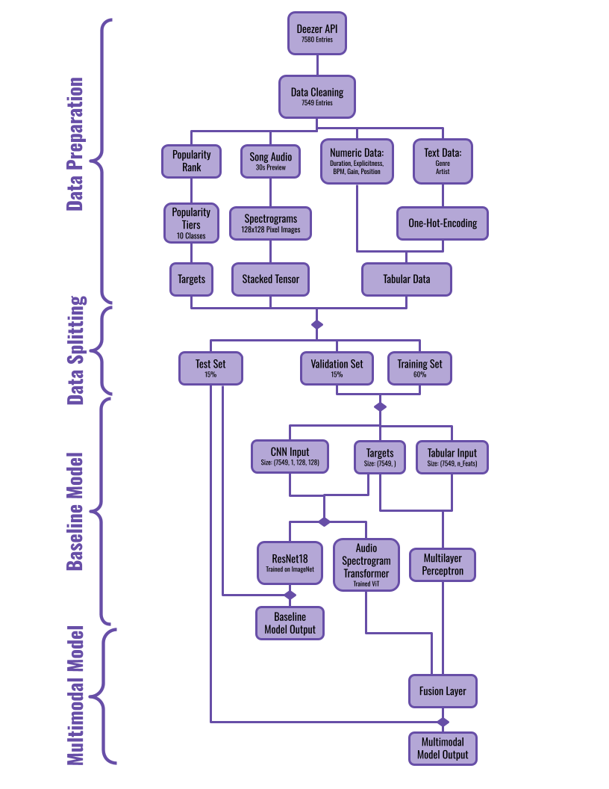

# Song Popularity Prediction Model

## Project Summary

This project builds a multimodal machine learning system to predict song popularity on Deezer. Given a 30-second audio preview and song metadata, the model predicts how popular a track will be. This model is useful for artists, labels, and streaming platforms looking to understand what makes a song resonate with listeners.

---

## Project Milestones

#### [Project Check-In 1](check-in-1.md)

#### [Project Check-In 2](check-in-2.md)

#### [Project Check-In 3](check-in-3.md)

## Task Definition

- **Problem type:** Ordinal classification (popularity tier prediction)
- **Inputs:** Mel-spectrogram of a 30-second audio preview + tabular metadata (genre, artist, mood, duration, contributor count, gain)
- **Output:** Popularity tier on a 1–5 scale (bucketed from Deezer's raw 1–100 score)
- **Dataset:** Deezer song catalog with audio previews and listener engagement signals

## Key Outcomes

| Model | Test Accuracy | Within-1 Accuracy |
|---|---|---|
| XGBoost baseline (PCA + metadata) | 14.83% | — |
| CNN baseline (ResNet-18 on spectrograms) | 14.30% | — |
| Multimodal AST + MLP (final model) | **43.95%** | **83.8%** |

- The final model fuses an **Audio Spectrogram Transformer (AST)** for audio with an **MLP** for tabular features, eliminating the severe overfitting seen in the CNN baseline (92.7% train vs. 26.6% test)
- **83.8% within-1 accuracy** means the model's prediction is within one tier of the true value in most cases, which is practical for ranking and recommendation tasks
- Demonstrated that multimodal fusion significantly outperforms single-modality approaches for popularity prediction

---

## Final Analysis

### Final Model / System Summary

The final system is a **multimodal fusion model** that processes two independent input streams and combines them before making a prediction:

- **Audio branch - Audio Spectrogram Transformer (AST):** Takes a 128-band mel-spectrogram of a 30-second audio preview as input. AST was chosen over ResNet-18 because it is purpose-built for spectrogram interpretation and captures long-range frequency-time dependencies that CNNs miss.
- **Tabular branch - Multilayer Perceptron (MLP):** Takes structured song metadata (genre, number of contributors, gain, and duration), scaled with Sklearn's `StandardScaler`.
- **Fusion layer:** A feed-forward layer concatenates the two branch embeddings, followed by a dropout layer to regularize the joint representation.
- **Loss function:** CORN (Conditional Ordinal Regression Network), which respects the ordered structure of the 1–5 tier labels and penalizes predictions that violate the ordinal ranking.
- **Training split:** 70% train / 15% validation / 15% test on ~7,549 songs.

This design replaced the earlier CNN-only approach after it became clear that audio spectrograms alone carry insufficient signal for popularity prediction — the addition of metadata was the primary driver of improvement.

## CNN Pipeline Architecture

### Evaluation Results and Interpretation

| Model | Train Accuracy | Test Accuracy | Ordinal MAE | Within-1 Accuracy |
|---|---|---|---|---|
| XGBoost (PCA + spectrograms) | — | 14.83% | 2.71 | — |
| CNN baseline (ResNet-18) | 92.73% | 14.30% | 2.06 | — |
| **Multimodal AST + MLP** | **42.10%** | **43.95%** | — | **83.8%** |

**Interpretation:**

- The CNN baseline's 66-point gap between train and test accuracy (92.7% vs. 26.6%) reveals near-complete memorization of training spectrograms with no generalization — a classic overfitting failure.
- The multimodal model closes this gap to under 2 points (42.1% train vs. 43.95% test), indicating the fusion architecture and CORN loss successfully regularized the model.
- **43.95% exact-match accuracy** on a 5-class problem is 3× better than random chance (20%) and nearly 3× better than the baselines.
- **83.8% within-1 accuracy** is the more practically meaningful metric: for recommendation and ranking use cases, being off by at most one tier is acceptable, and the model achieves this on the vast majority of songs.

### Limitations, Failure Modes, and Next-Step Ideas

**Limitations:**
- **Class imbalance:** Tier 1 is substantially over-represented in the dataset. Even with weighted random sampling, the model is biased toward accurately predicting lower popularity tiers and struggles with Tier 4 and 5 predictions.
- **Exact-match accuracy limitations:** 43.95% is still far from deployment-ready. The ordinal framing helps (83.8% within-1), but exact prediction of popularity is an inherently noisy task. Human listening behavior is difficult to model from 30-second clips.
- **Audio preview length:** A 30-second clip may not capture the hook, drop, or outro that drives virality. Full-track analysis could surface different signal.

**Failures:**
- The model systematically underpredicts high-popularity songs (Tier 5), likely because viral hits are outliers that don't follow patterns learned from the training distribution.
- Songs with very similar spectrograms but wildly different popularity (same genre, similar instrumentation) confuse the audio branch, putting pressure on the metadata branch to disambiguate.

**Next-step ideas:**
- **Richer metadata:** Incorporate BPM, key, mode, time signature, and lyrical sentiment via NLP on song lyrics.
- **Contrastive pre-training:** Pre-train the AST on a music-specific task (genre classification, mood detection) before fine-tuning for popularity to improve audio representations.
- **Better class balancing:** Oversample or synthesize examples for higher tiers using audio augmentation (pitch shifting, time stretching).
- **Regression framing:** Predict a continuous popularity score rather than discrete tiers and threshold at inference time, which may smooth out label boundary noise.
- **Artist-level features:** Artist follower count and historical popularity trajectory are likely strong signals that were not used here.

