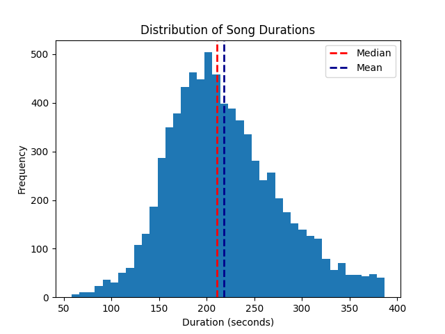
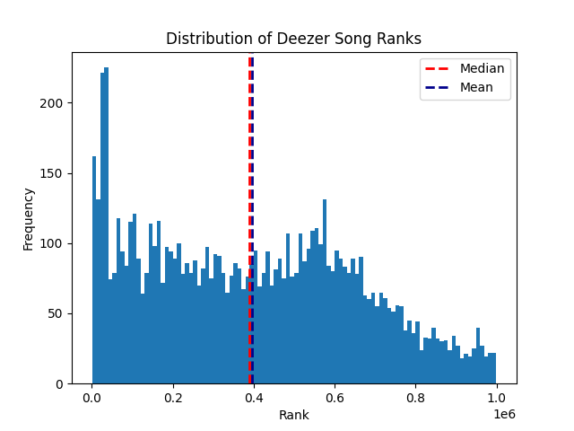
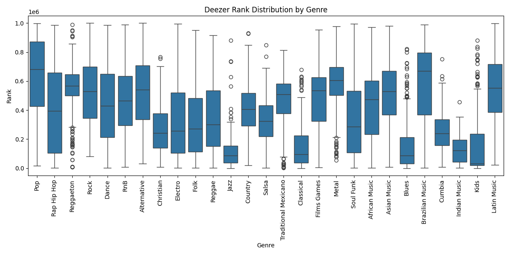
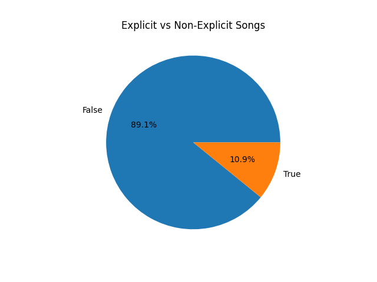
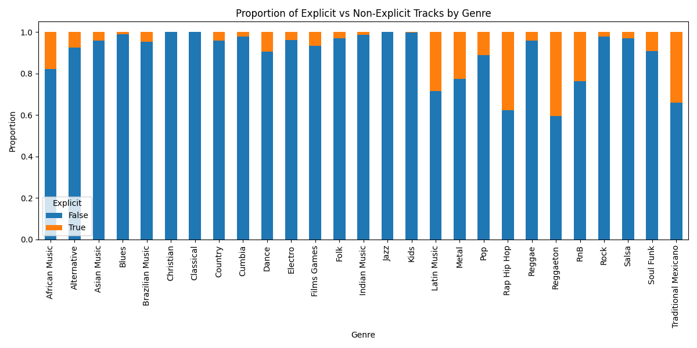

# Project Check-In 1
Akshay Arun | 9 March 2026

## Problem Statement + Scope

#### Task Definition:
This project frames song popularity prediction as a multimodal regression task. Given a 30-second audio preview of a song, the goal is to predict its popularity rank on Deezer using a joint audio-text embedding space. 

#### Research Question
Can a shared embedding space between mel-spectrogram representations and text descriptors (genre, artist, mood) meaningfully capture the acoustic and contextual features that drive popularity?

The task is treated as regression, predicting a normalized version of Deezer's rank field (total stream-weighted popularity score, normalized to [0, 1] across the dataset).

#### Modality
Multimodal — audio (mel-spectrograms as the visual modality) + text (genre labels, artist names, and mood descriptors as the language modality).

#### Success Criteria

1. the multimodal model achieves lower MAE and higher R² on the held-out test set than a unimodal spectrogram-only CNN baseline
2. embedding space visualizations (t-SNE/UMAP) show meaningful clustering by genre and popularity tier
3. zero-shot text queries (e.g., "upbeat popular dance track") retrieve acoustically relevant songs from the embedding space

## Data Access + Documentation

Data was accessed using Deezer's Public API. Deezer is a music entertainment app, similar to Spotify or iTunes. Their API allows for access to current data on song information, and allows for the download of the first 30 seconds, with no need for an API key. 

Documentation on where to find and interpret the data, and how download song snippets can be found in [documentation/data_access.md](documentation/data_access.md)

## Data Audit / EDA

EDA code can be found at [eda/eda.ipynb](eda/eda.ipynb)

### Music Genre

There are 27 different genres in Deezer's API, each with a unique ID outlined [here](documentation/genres.md).

Each genre had 300 songs downloaded from the API, with the exception of Indian music, which, due to low volume, only has 179 entries.

### Song Duration

### Deezer Rank

### Song Explicitness

## Evaluation Plan

#### Primary Metrics

* MSE on normalized rank
* R^2

#### Baseline Comparisons
Results will be reported against three baselines in order of increasing sophistication:

* Mean predictor — always predicts the dataset mean rank (lower bound)
* Genre-mean predictor — predicts the mean rank for the track's genre (tests whether genre alone is sufficient)
* Unimodal CNN — ResNet-50 fine-tuned on spectrograms only, no text (tests whether audio alone is sufficient)

#### Split Strategy

* 70% train / 15% validation / 15% test
* Stratified by genre to ensure all 28 genres are represented proportionally in each split

## Initial Baseline

#### Spectrogram Pipeline
Audio previews are downloaded via the Deezer API, converted from MP3 to WAV, and processed with librosa into 128-band mel-spectrograms sampled at 22,050 Hz. Spectrograms are saved as square images to match standard pretrained CNN input dimensions.

#### Unimodal CNN Baseline
The first model to be trained is a ResNet-50 pretrained on ImageNet with its final fully connected layer replaced by a regression head. The backbone will initially be frozen, training only the head, then unfrozen for fine-tuning in a second pass. This serves both as a sanity check on the spectrogram pipeline and as the primary comparison point for the multimodal model.

