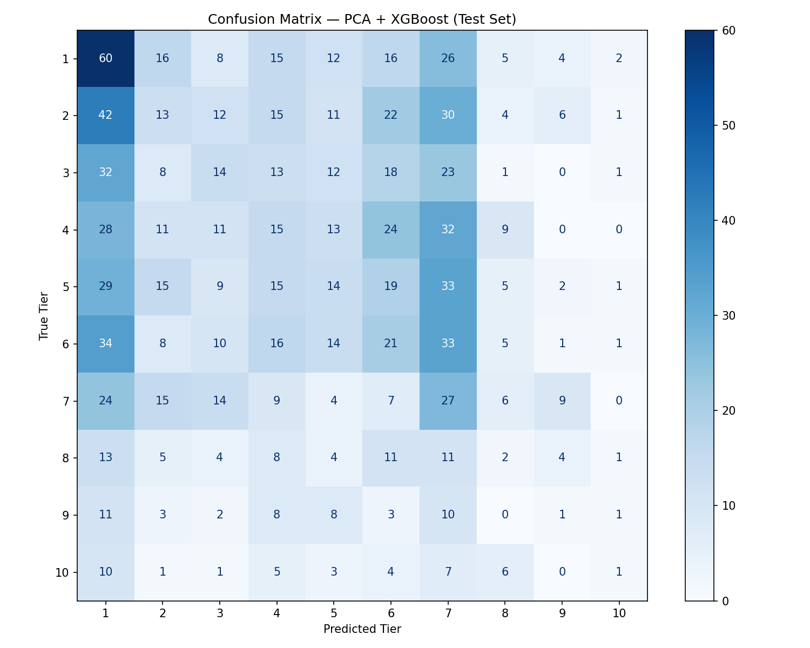
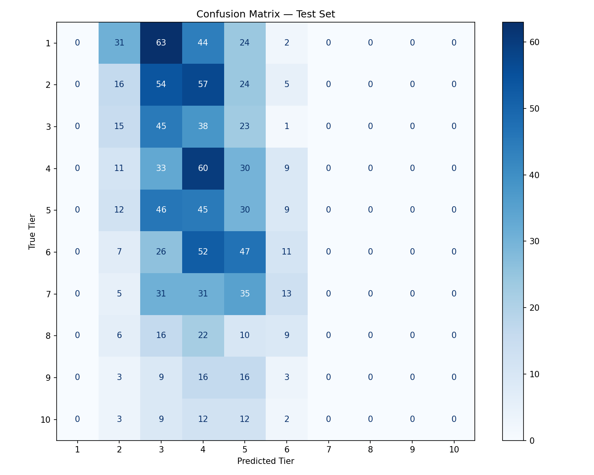

# Project Check-In 2
Akshay Arun | 30 March 2026

## Classical (Non-Deep) Baseline

### Project Pipeline
#### Data Input
* Inputs: Pytorch Tensors of the Spectogram
* Labels: Deezer API popularity tier
#### Data Preperation:
1. The Pytorch Tensor was Flattened (7549, 1, 128, 128) → (7549, 16384)
2. Labels were shifted down by 1 (0-9 rather than 1-10)
3. 15-15-70 Train/Validation/Test Split
4. Flattened input was scaled using Sklearn Standard Scaler
5. PCA dimensionality reduction
#### Training
* XG-Boost Classification:
    * Number of Estimators: 500
    * Max Tree Depth: 6
    * Learning Rate: 0.05
    * Loss Function: Multiclass Log Loss
    * Weighting: Balanced Sampling

### Results/Evaluation
 * Test Accuracy: 0.1483
 * Test Ordinal MAE: 2.7132
#### Confusion Matrix

#### Analysis

The main pitfall of this XG-Boost model seems to be the heavy overprediction of Tier 1. Despite the sample balancing used to combat the model still seems to be susceptible to the class imbalance present, given that Tier 1 has more entries than any other class. 

## CNN Baseline

### Project Pipeline
#### Data Input
* Inputs: Pytorch Tensors of the Spectogram
* Labels: Deezer API popularity tier
#### Data Preperation
1. The tensor was stacked 3 times, so ResNet could be trained on it as if it was an RGB image without the need for extra hyperparameters in a 1D convolution.
2. Labels were shifted down by 1 (0-9 rather than 1-10)
3. 15-15-70 Train/Validation/Test Split
4. Class weights were computed to combat class imbalance
#### Training
* Convolutional Neural Network
    * ResNet18 Backbone
    * Fully-Connected Layers:
        * 0.5 Dropout Layer
        * Linear Activation Layer
        * ReLU Activation Layer
        * 0.3 Dropout Layer
        * Linear Activation Layer
    * Froze All Layers Except 3rd, 4th, and Fully-Connected
    * Optimizer: Adam
        * Backbone Learning Rate: 1e-4
        * Head Learning Rate: 1e-3
        * Weight Decay: 1e-3
    * Learning Rate Scheduler
        * Patience: 2
        * Reduction Factor: 0.5
    * 100 Epochs w/ Patience=5
    * Loss: CORN Loss Function
    
### Results/Evaluation

* Test Accuracy: 0.1430
* Test Ordinal MAE: 2.0574

#### Confusion Matrix

#### Analysis

The main pitfall seems to be the CORN loss function, which is used in this case for Ordinal Multiclass Classification, as, for instance, a 1 classified as a 10 should be penalized more than a 9 classified as a 10. This leads to a very center-dispersed prediction result. 

## Failure Analysis

The main failures of both the Classical and CNN baseline models seems to be the limits of the Spectrogram in terms of what it gives you regarding popularity. Despite many attempts at class balancing, loss function and optimizer changes, and ways to combat overfitting, the models still remain incredibly inaccurate. The introduction of other modes of input such as song duration, genre, bpm, and gain, will definitely improve the results, as well as the replacement of an Audio Spectrogram Transformer, a ViT adapted specifically for Spectrogram inputs. 

