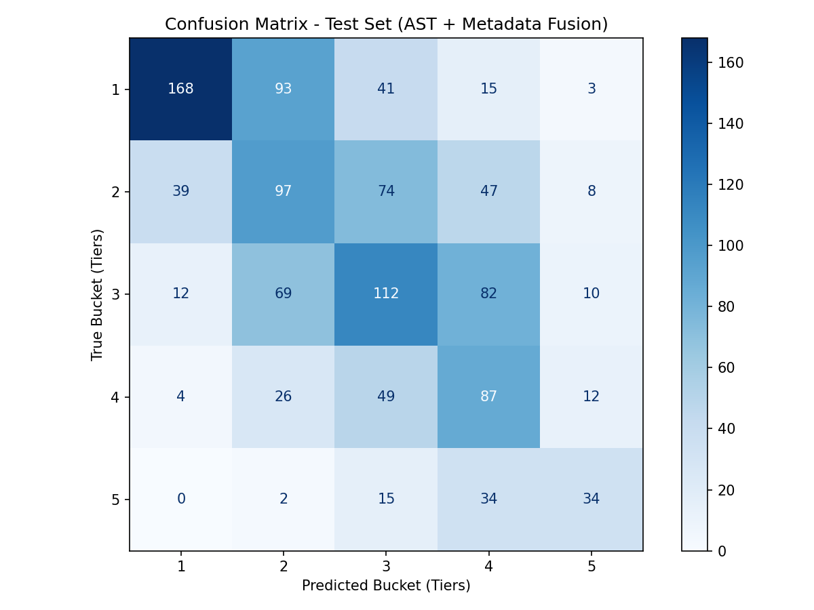

# Project Check-In 3
Akshay Arun | 28 April 2026

## Advanced Extension Implementation

### Project Pipeline

#### Data Input
* Inputs: 
    * Pytorch Tensors of the Spectogram
    * Metadate (Genre, # Contributers, Gain, Song Duration)
* Labels: Deezer API popularity tier
#### Data Preperation:
1. The Pytorch Tensor was Flattened (7549, 1, 128, 128) → (7549, 16384)
2. Labels bucketed (Scale from 1-5)
3. 70-15-15 Train/Validation/Test Split
4. Flattened input was scaled using Sklearn Standard Scaler
5. PCA dimensionality reduction
#### Training
* Audio Training: AST (Audio Spectogram Transformer)
* Tabular Data Training: MLP (Multilayer Perceptron)
* Fusion Feed-Forward Layer
* Dropout Layer
* CORN Loss

## Baseline Comparison

**Baseline Results**

* Training Accuracy: 92.73%
* Test Accuracy: 26.57%

**Advanced Model Results**

* Training Accuracy: 42.10%
* Test Accuracy: 43.95%
* Within-1 Accuracy: 83.8%

**Comparison**
* Eliminated Overfitting
* Slightly Higher Accuracy
* Predictions Much Closer Regardless of Exact Accuracy

## Controlled Comparison Example

* Testing: That's so True (Gracie Abrams)
* True Tier: 5 
* Baseline CNN: 2/5
* Advanced Model: 5/5

## Failure Analysis

Despite the obvious better performance in the confusion matrix, the baseline accuracy could still use a lot of work. Also, even with the weighted random sampling, the model still seems more likely to accurately predict the lower end compared to the higher end.